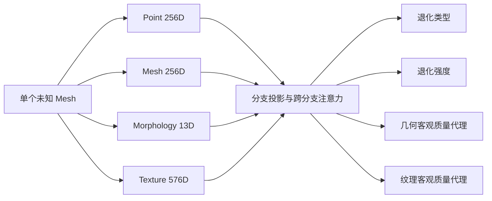

# 单体 Mesh 无参考质量评估：相关开源方法与当前借鉴方案

## 研究定位

实际应用只有一个待测单体 Mesh，通常没有未退化原始模型。因此正式 Quality Head 应采用无参考（No-Reference, NR）推理：训练阶段可以用原始—退化模型对生成监督或教师信号，部署时只能输入待测模型。

当前任务没有人工 MOS 主观分数，暂以可复现退化的类型、强度，以及由原始—退化模型对计算的几何/纹理客观指标作为训练标签。这是“客观质量代理预测”，不能直接表述为人类感知质量预测。

## 可借鉴的公开工作

### R3-PCQA（CVPR 2026）

- 论文：[R3-PCQA: Ray-Reprojection-Reinforcement for No-Reference 3D Point Cloud Quality Assessment](https://openaccess.thecvf.com/content/CVPR2026/html/Seo_R3-PCQA_Ray-Reprojection-Reinforcement_for_No-Reference_3D_Point_Cloud_Quality_Assessment_CVPR_2026_paper.html)
- 任务：无参考点云质量评估；论文报告在 SJTU-PCQA、WPC 和 WPC2.0 上验证。
- 核心：几何感知 ray reprojection、质量显著 subcloud 选择、跨视角全局注意力。
- 当前借鉴优先级：高。先借鉴“视角—三维区域显式对应”和显著局部区域聚合，不在
  第一轮引入强化学习；已有 16 个 Mesh Patch 和 UV 映射足以构造更小、更可控的
  deterministic salient-patch 版本。

### HybridMQA（CVPR 2025）

- 论文：[HybridMQA: Exploring Geometry-Texture Interactions for Colored Mesh Quality Assessment](https://openaccess.thecvf.com/content/CVPR2025/papers/Sarvestani_HybridMQA_Exploring_Geometry-Texture_Interactions_for_Colored_Mesh_Quality_Assessment_CVPR_2025_paper.pdf)
- 代码：[arshafiee/hybridmqa](https://github.com/arshafiee/hybridmqa)
- 任务：彩色 Mesh 全参考质量评估。
- 核心：把 Mesh 表面图特征投影到与彩色渲染严格对齐的二维位置，再用 cross-attention
  建模几何—纹理交互。
- 当前借鉴优先级：局部纹理路线最高。它不能直接作为我们的部署模型，因为推理需要
  reference；但其 feature projection/alignment 可改造成单模型 Patch Token，Clean 配对
  只在离线阶段生成局部纹理监督。

### QD-PCQA（CVPR 2026）

- 论文：[QD-PCQA: Quality-Aware Domain Adaptation for Point Cloud Quality Assessment](https://openaccess.thecvf.com/content/CVPR2026/html/Zhang_QD-PCQA_Quality-Aware_Domain_Adaptation_for_Point_Cloud_Quality_Assessment_CVPR_2026_paper.html)
- 代码：[huhu-code/QD-PCQA](https://github.com/huhu-code/QD-PCQA)
- 核心：rank-weighted conditional alignment 与 quality-guided style mixup，面向跨域 NR-PCQA。
- 使用边界：不得把 Test/Blind 特征当无标签目标域参与适配，否则破坏锁定协议。第一阶段
  只在五个 Train 图幅内部做 robust normalization、tile-balanced sampling 和
  worst-tile 优化；若仍不足，第二阶段只允许 Train 图幅间的 style mixup/alignment。

### CoPA（CVPR 2024）

- 论文：[Contrastive Pre-Training with Multi-View Fusion for No-Reference Point Cloud Quality Assessment](https://openaccess.thecvf.com/content/CVPR2024/html/Shan_Contrastive_Pre-Training_with_Multi-View_Fusion_for_No-Reference_Point_Cloud_Quality_CVPR_2024_paper.html)
- 任务：无参考点云质量评估。
- 可借鉴点：质量感知对比学习、多视图/多分支融合、面向未见失真的泛化。
- 当前采用：让相同退化类型的不同建筑在质量嵌入空间接近，并保持身份 Base 冻结，避免把“建筑是谁”和“质量如何”混为一谈。

### 3DTA-PCQA（IEEE TMM 2024）

- 代码：[3DTA-PCQA](https://github.com/philox12358/3DTA-PCQA)
- 任务：无参考点云质量评估。
- 可借鉴点：局部 Patch 表征、通道和空间注意力。
- 当前采用：将 Point、Mesh、Morphology、Texture 看作四个质量 Token，用跨分支注意力和几何/纹理任务门控融合；后续可进一步加入原始 Patch Token。

### COPP-Net（IEEE Transactions on Broadcasting 2025）

- 代码：[COPP-Net](https://github.com/philox12358/COPP-Net)
- 任务：基于加权局部 Patch 质量预测的无参考点云质量评估。
- 可借鉴点：先预测局部区域质量，再学习 Patch 可靠性/相关性权重，汇总为整体分数。
- 当前采用：对 16 个 Mesh Patch 输出有序质量证据，并通过学习权重聚合；不照搬其点云网络。

### ORNet 与相对排序

- 代码页面：[ORNet](https://github.com/wei10-pc/ORNet)（截至核查时仅公开说明，未公开完整实现）。
- 可借鉴点：把连续质量评价拆成多个有序阈值判断，连续推理恢复分数；训练中加入高低质量相对顺序。
- 当前采用：9 个有序阈值、单调一致性约束和成对排序损失。由于 ORNet 完整代码未开放，本项目只依据论文思想自行实现，不把它列为已复现基线。

### NR-3DQA（IEEE TCSVT 2022）

- 代码：[NR-3DQA](https://github.com/zzc-1998/NR-3DQA)
- 任务：彩色点云和 Mesh 的无参考质量评估。
- 可借鉴点：几何与颜色自然统计特征，以及较强的可解释性。
- 当前采用：Morphology、Mesh、Texture 独立分支保留几何/拓扑/外观质量线索；后续补充网格局部统计描述量。

### Graphics-LPIPS（ACM TOG / SIGGRAPH 2023）

- 代码：[Graphics-LPIPS](https://github.com/MEPP-team/Graphics-LPIPS)
- 数据集：[Textured Mesh Quality Assessment Dataset](https://datasets.liris.cnrs.fr/textured-mesh-quality-assessment-dataset-version1)
- 任务：有参考纹理 Mesh 质量评估。
- 可借鉴点：多视角渲染、局部图像 Patch 感知距离和主观质量数据。
- 使用边界：适合作为纹理教师或外部验证基线，不适合直接充当我们的无参考部署网络；公开数据约 76.9 GB，不符合当前“香港数据快速迭代”的优先级。

## 对当前实验的直接决策

1. 第一轮不堆叠前沿模块，只隔离验证 normalization、图幅均衡和 worst-tile 三个变量；
2. Blind 绝不作为 QD-PCQA 式无标签目标域，任何域适配仅发生在 Train 图幅之间；
3. 局部纹理真值采用 `Mesh face → UV triangle → texture region`，再考虑以
   Graphics-LPIPS/LPIPS 类感知距离作为离线教师；
4. 局部纹理模型优先实现 HybridMQA 式对齐 token 和轻量 cross-attention；
5. R3-PCQA 的显著区域思想先以确定性 top-k Patch/attention 消融验证，通过 Val 后再
   判断是否值得引入强化学习选择器。

### PointPCA

- 论文：[PointPCA: Point Cloud Objective Quality Assessment Using PCA-Based Descriptors](https://arxiv.org/abs/2111.12663)
- 代码：[PointPCA](https://github.com/cwi-dis/pointpca)
- 任务：有参考点云客观质量评估。
- 可借鉴点：局部 PCA 几何/颜色统计和可解释特征融合。
- 使用边界：可用于产生几何质量标签或作为全参考教师，不可直接解决单模型无参考推理。

## 当前实现

- 身份 Base 冻结，只训练 Quality Student。
- 训练可使用原始—退化对计算真值；推理不输入原始模型。
- 对比普通注意力、质量感知对比学习、几何损失增强三种受控变体。
- 单种子为 2026；Val 选择模型，Test/Blind 锁定。

## 下一阶段的关键缺口

1. 当前合成退化覆盖有限，需加入真实拍照后二次重建、真实孔洞/缺面和遮挡样本验证未见失真泛化。
2. 无纹理 GLB/OBJ 的 geometry-only 分数仍存在格式转换偏差，需要建立配对跨格式一致性训练协议。
3. 若要声称“感知质量”，必须加入 MOS/DMOS 主观标注或在公开主观质量数据集做外部验证。

## 局部 Mesh Patch 实验结果（seed=2026）

每个 Mesh 通过最远点采样选择 16 个三角面中心，每个中心聚合附近 32 个面；每个 Patch 使用 58 维统计描述，包括面中心、法向、边长、面积、二面角的均值/标准差/极值，以及法向离散、边界率、尖锐边率、邻接完整性和三角形长宽比。

| 模型 | Test 几何 NMAE ↓ | Blind 几何 NMAE ↓ | Test 强度 MAE ↓ | Blind 强度 MAE ↓ |
|---|---:|---:|---:|---:|
| 四分支无参考学生 | 0.635 | 0.819 | 0.063 | 0.078 |
| 四分支 + 局部 Patch | **0.547** | **0.739** | **0.055** | **0.076** |
| Patch + 几何对比约束 | 0.688 | 0.825 | 0.056 | **0.076** |

结论：局部 Patch 对几何质量预测有实质提升；额外几何对比约束没有通过 Val 选择并在 Blind 退化，因此主模型采用不带对比约束的局部 Patch 版本。相对于四分支基线，Test/Blind 几何 NMAE 分别相对降低约 14.0% 和 9.7%。

补充的任务解耦实验让 Patch 只进入几何头，其 Blind 几何 NMAE 达到 0.690，但 Val 综合误差为 0.321，高于共享 Patch 的 0.314，且 Test 几何 NMAE 退化至 0.660。按照预注册的 Val 选择规则，该版本只保留为附加消融，不能依据 Blind 结果改选为主模型。

## 0–100 客观质量指数实验（seed=2026）

质量真值定义为退化强度与对应几何/纹理客观误差的组合，100 表示当前协议下的无退化状态，0 表示最差。它不是人工 MOS。

最终模型使用 Val 选择的融合：`0.75 × 有序加权 Patch 模型 + 0.25 × 多任务确定性公式`。

| 数据集 | MAE（分）↓ | PLCC ↑ | SRCC ↑ | 成对排序准确率 ↑ | 误差≤10分 ↑ |
|---|---:|---:|---:|---:|---:|
| Val | 6.43 | 0.814 | 0.812 | 0.885 | 80.6% |
| Test | 5.96 | 0.864 | 0.821 | 0.898 | 81.3% |
| Blind | 7.10 | 0.785 | 0.747 | 0.857 | 75.2% |

相较直接使用 `100 × (1 - 预测强度)`，Test MAE 从 15.52 降至 5.96，Blind MAE 从 15.67 降至 7.10。该指数适合称为 Objective Quality Index（OQI）；在引入主观评分实验以前，不称为感知质量 MOS。

## 单模型报告与单调性审计

已实现 `.gltf/.glb/.obj` 单文件推理，输出 OQI、几何/纹理分数、退化类型与置信度、退化强度、低质量 Patch 及网格审计信息，并可导出 JSON/CSV。

- 清洁 glTF 样例 `B412542125301063A0`：OQI 99.41，clean 置信度 0.9997。
- Test：清洁分数高于同一建筑攻击版本的比例为 97.66%。
- Blind：清洁分数高于攻击版本的比例为 95.31%。
- 对 connected crop 和 hole 两级攻击，攻击级平均 OQI 均随强度增加而下降。
- 逐建筑严格强度单调准确率为 Test 64.06%、Blind 67.19%，仍是下一阶段主要优化项。

跨格式接口已跑通。对有纹理 glTF 输出几何—纹理联合 OQI；对无纹理 GLB/OBJ 只输出 geometry-only OQI，并明确返回 `texture_quality=null`，两种范围不能直接横向比较。同一 Blind 样例的 glTF 联合 OQI 为 98.73，GLB/OBJ 的 geometry-only OQI 分别为 81.48/84.82。几何分数仍存在格式转换偏差，说明接口可用不等同于跨格式质量完全一致。

## 两项受控优化的结论

### 显式强度排序约束

对同一建筑、同一种攻击的不同强度版本加入 RankNet 排序约束，并比较相邻强度对与全部有序强度对。两版均未通过 Blind：主方案 Blind SRCC 为 0.747，两个排序版本分别为 0.731 和 0.712；严格强度单调性也没有稳定提升。因此保留原 OQI 为主模型，把排序版本记为负消融。结果表明当前单调性瓶颈更可能来自跨建筑泛化，而不是缺少排序损失。

### 缺纹理模态建模

加入训练期纹理 dropout、显式纹理可用标记和学习型缺失纹理 token。它在无纹理几何子集上没有优于原学生：

| 模型 | Test 几何 NMAE ↓ | Blind 几何 NMAE ↓ | Test 攻击分类准确率 ↑ | Blind 攻击分类准确率 ↑ |
|---|---:|---:|---:|---:|
| 原局部 Patch 学生 | **0.534** | **0.704** | 0.714 | **0.693** |
| 缺纹理感知学生 | 0.808 | 0.746 | **0.729** | 0.677 |

因此不部署缺纹理 token。正式单模型接口在没有纹理时只报告 `geometry-only OQI` 和 `texture_quality=null`，不把无法观察的纹理质量填充进总分；有纹理 glTF 仍使用原来的几何—纹理联合 OQI。
